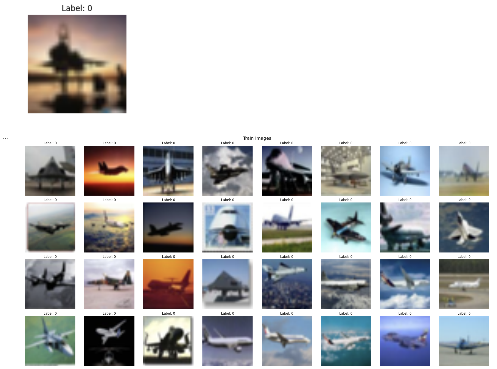

# Image Retrieval System using Locality-Sensitive Hashing (LSH)

## Overview

This project explores two variants of locality-sensitive hashing (LSH) for image retrieval. We implement an image retrieval system using **K-Means**, **random projection hashing** and **neural hashing** methods to retrieve images from a gallery set based on query images. We evaluate these methods using standard ranking metrics such as **mean average precision (mAP)**, **Precision@10**, and **Precision@50**.

The project was implemented using the following datasets:
- CIFAR-10 https://huggingface.co/datasets/aaaakash001/cifar10_Vit_large(Dataset contains features from VIT_large model)
- CIFAR-100 https://huggingface.co/datasets/aaaakash001/cifar100_Vit_large (Dataset contains features from VIT_large model)
- ImageNet-1K https://huggingface.co/datasets/evanarlian/imagenet_1k_resized_256 (Dataset doesn't contain features )

Additionally, pre-trained VIT_Large models were used for feature extraction to compare the performance of LSH methods with learned feature embeddings.

## Methods

We explored the following techniques:
1. **K-Means Clustering**: Used as a baseline to cluster image features from the gallery set.
2. **Random Projection Hashing**: Implemented using random hyperplane splits to develop hash buckets.
3. **Neural LSH**: Developed a learned hashing mechanism to improve upon random projection hashing using a data-driven approach. Based on the paper https://arxiv.org/pdf/2012.08974
4. **Neural LSH (Method 2)**: Adapted a learned hashing mechanism to improve upon random projection hashing using a data-driven approach. Baed on the paper https://indradyumna.github.io/pdfs/2023_FourierHashNet.pdf

## Datasets

We used the following datasets in the project:
- **CIFAR-10**: Contains 60,000 32x32 images in 10 classes.
- **CIFAR-100**: Contains 60,000 32x32 images in 100 classes.
- **ImageNet-1K**: A large-scale dataset with 1.2 million images across 1,000 categories.

All datasets were loaded using **torchvision** and **HuggingFace Hub**.

## Evaluation Metrics

To evaluate the performance of the image retrieval system, we used the following metrics:
- **Mean Average Precision (mAP)**: Measures the average precision across all queries.
- **Precision@10**: Precision of the top 10 retrieved results.
- **Precision@50**: Precision of the top 50 retrieved results.

Ranking of retrieved images was based on:
- **Cosine Similarity**: For continuous feature embeddings.
- **Hamming Distance**: For binary hash codes.

## Results

The results indicate that:
- **Neural LSH** outperforms **random projection hashing** in terms of precision and retrieval speed.
- Dimensionality reduction (using PCA) improved performance in **K-means**.
- The best results were observed using **Neural LSH (Method 2)**:
    **CIFAR-10:**
    - Mean Average Precision (mAP): 0.9633219885694009
    - Precision@10: 0.955283807194538
    - Precision@50: 0.9482380515642514

    **CIFAR-100:**
    - Mean Average Precision (mAP): 0.7591631374544702
    - Precision@10: 0.8424763629048481
    - Precision@50: 0.7205169985918326



## How to Run

1. Install the required dependencies:
   ```bash
   pip install -r requirements.txt

2. Run the required .ipynb files.
